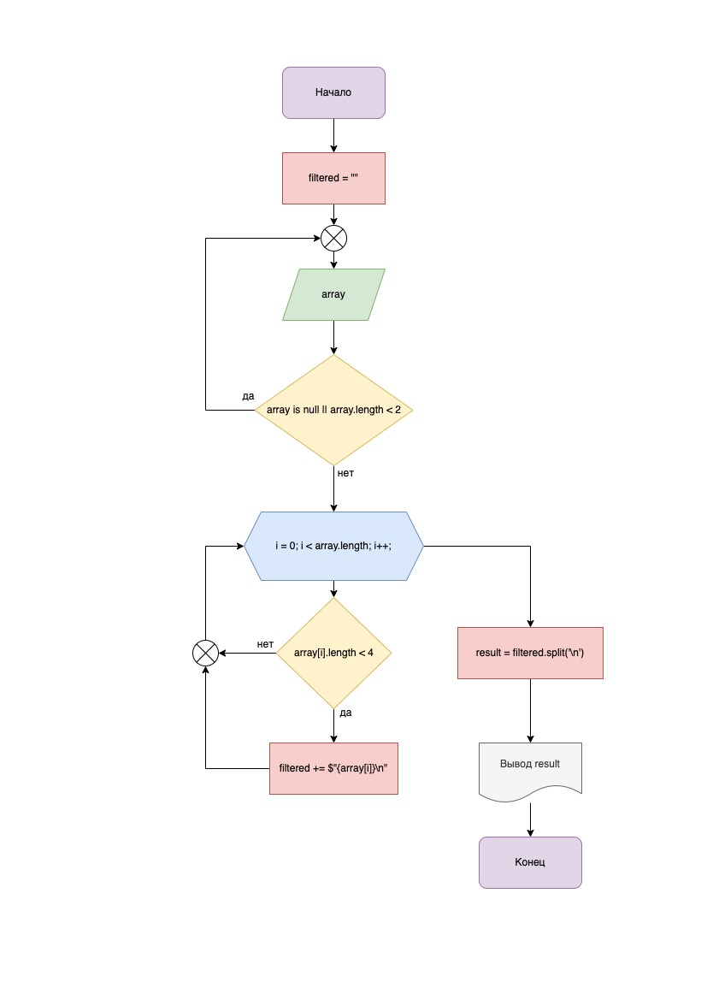

# **Итоги блока. Выбор специализации**

## Итоговая проверочная работа.

> **Задача:** Написать программу, которая из имеющегося массива строк формирует массив из строк, длина которых меньше либо равна 3 символа. Первоначальный массив можно ввести с клавиатуры, либо задать на старте выполнения алгоритма. При решении не рекомендуется пользоваться коллекциями, лучше обойтись исключительно массивами.

> **Примеры:**
>
> ["hello", "2", "world", ":-)"] -> ["2", ":-)"]
>
> ['1234", "1567", "-2", "computer science"] -> ["-2"]
>
> ["Russia", "Denmark", "Kazan"] -> []

> **Решение:**
>
> - Задаём исходный массив строковых значений *"array"*, путём ввода их в консоль разделяя символом пробела
> - Определяем пустую строковую переменную *"filtered"* для добавления в неё элементов исходного массива, которые удовлетворяют заданным условиям (их длина меньше или равна 3 символам)
> - Производим перебор элементов массива, в случае, если длина текущего элемента меньше 4 символов, производим конкатенацию строковой переменной *"filtered"* с текущим элементом массива и символом переноса строки '\n'
> - Следующим шагом получаем результирующий массив *"result"*, разделяя переменную *"filtered"* символом '\n', исключая пустые элементы
> - На завершающем этапе выводим результат работы программы в консоль

> **Блок-схема работы программы:**
>
> 